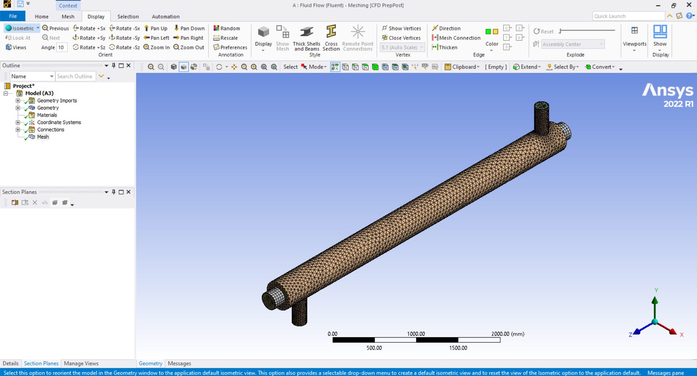

# PROJECT 6 — COMPLETE CONTENT BRIEF FOR ANTIGRAVITY
## Shell & Tube Counterflow Heat Exchanger — CFD Analysis
## Covers: projects.html (card) + project-6.html (full detail page)

---

## STEP 0 — IMAGES TO COPY FIRST

Confirm these two image files exist in portfolio root:
C:\Users\4star\Desktop\Claude dev\portfolio\

- 1773835711032_Capture.PNG  → SolidWorks 3D render of heat exchanger
- 1773835711033_mesh.PNG     → ANSYS CFD mesh visualization

If missing, stop and report before continuing.

---

# PART 1 — UPDATE projects.html (Project 06 Card Only)

Open projects.html via Filesystem MCP.
Find Project 06 card — identifiable by [OWNER_PROJECT_6_TITLE]
or link to project-6.html. Edit that card only.

CARD IMAGE:
src="1773835711033_mesh.PNG"
alt="ANSYS CFD mesh of shell and tube counterflow heat exchanger"

CARD TITLE — replace [OWNER_PROJECT_6_TITLE] both instances:
Shell & Tube Heat Exchanger CFD

CARD TAGS:
[OWNER_P6_TAG_1] → SolidWorks
[OWNER_P6_TAG_2] → ANSYS Fluent
[OWNER_P6_TAG_3] → CFD

CARD SUMMARY — replace [OWNER_P6_SUMMARY]:
Shell and tube counterflow heat exchanger designed in SolidWorks
and analysed using ANSYS Fluent CFD simulation.

CARD OUTCOME 1 — replace [OWNER_P6_OUTCOME_1]:
CFD simulation validated counterflow heat exchange behaviour

CARD OUTCOME 2 — replace [OWNER_P6_OUTCOME_2]:
Complete design-to-simulation pipeline executed independently

Save projects.html and confirm before moving to Part 2.

---

# PART 2 — UPDATE project-6.html (Full Detail Page)

Open project-6.html via Filesystem MCP.

PAGE TITLE:
Shell & Tube Counterflow Heat Exchanger CFD — [OWNER_NAME] Portfolio

META DESCRIPTION:
Personal project: shell and tube counterflow heat exchanger designed
in SolidWorks and analysed through ANSYS Fluent CFD simulation to
study heat exchange behaviour.

PROJECT NUMBER: keep as Project 06

PROJECT TITLE:
Shell & Tube Counterflow Heat Exchanger CFD

TAGS — replace Accessibility / Angular / WCAG 2.1 / UX Research:
SolidWorks / ANSYS Fluent / CFD / Thermal Analysis

DATE — DELETE this element entirely:

Mar 2022 — Jul 2022

HERO IMAGE:
src="1773835711032_Capture.PNG"
alt="SolidWorks 3D render of shell and tube counterflow heat exchanger"

PROJECT OVERVIEW TEXT:
Designed a shell and tube counterflow heat exchanger in SolidWorks
and conducted a Computational Fluid Dynamics simulation in ANSYS
Fluent to study the thermal and fluid behaviour of the system.
The project was completed independently in 2024 as a self-directed
engineering exploration into heat transfer and CFD methodology.

CHALLENGE TEXT:
The core challenge was accurately modelling the counterflow
configuration — where hot and cold fluids flow in opposite
directions through the shell and tube arrangement — and setting
up a CFD simulation that correctly captured the heat exchange
between the two fluid streams. This required careful geometry
modelling in SolidWorks, clean mesh generation in ANSYS, and
correct boundary condition definition for both inlet and outlet
flow conditions.

SOLUTION TEXT:
Modelled the shell and tube geometry in SolidWorks with inlet
and outlet ports for both the shell-side and tube-side fluid
circuits. Imported the geometry into ANSYS Fluent and generated
a CFD mesh across the full assembly. Defined boundary conditions
for the counterflow configuration — hot fluid entering from one
end while cold fluid entered from the opposite end. Ran the
simulation and analysed the results to observe temperature
distribution, velocity profiles, and heat transfer behaviour
across the exchanger length.

ADD MESH IMAGE after detail-prose closing tag, before detail-meta:

  

TECH STACK TAGS — replace Angular / TypeScript / FHIR API / axe-core:
SolidWorks / ANSYS Fluent / CFD Meshing / Thermal Analysis

YEAR: 2024

ROLE:
Individual Project — Design, Meshing & CFD Simulation

OUTCOME ITEM 1:
Counterflow heat exchange behaviour successfully captured
through CFD simulation — temperature and velocity profiles
validated across the full exchanger length

OUTCOME ITEM 2:
Clean mesh generated across complex shell and tube geometry
in ANSYS — simulation ran without convergence issues

OUTCOME ITEM 3:
Complete design-to-simulation pipeline executed independently —
SolidWorks geometry, ANSYS meshing, and Fluent CFD analysis
completed end to end

NAVIGATION:
Previous: href="project-5.html"
Next: href="project-7.html"

FOOTER — leave [OWNER_NAME] and [OWNER_EMAIL] tokens as-is.

---

# FINAL INSTRUCTIONS

After completing both parts:
1. Confirm both images exist in portfolio root
2. Save projects.html — confirm saved
3. Save project-6.html — confirm saved
4. Puppeteer screenshot of projects.html at 1440px — confirm
   Project 06 card shows mesh image and correct title
5. Puppeteer screenshot of project-6.html at 1440px
6. Report any issues
7. Do not touch any other file
